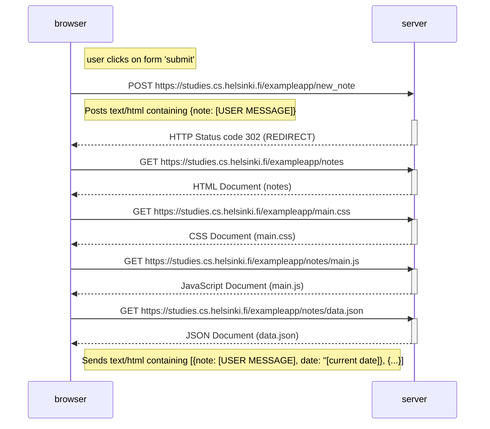

```mermaid
sequenceDiagram
    participant browser
    participant server

note right of browser: user clicks on form 'submit'

browser ->> server: POST https://studies.cs.helsinki.fi/exampleapp/new_note
note right of browser: Posts text/html containing {note: [USER MESSAGE]}
activate server
server -->> browser: HTTP Status code 302 (REDIRECT)
deactivate server


browser ->> server: GET https://studies.cs.helsinki.fi/exampleapp/notes
activate server
server -->> browser: HTML Document (notes)
deactivate server

browser ->> server: GET https://studies.cs.helsinki.fi/exampleapp/main.css
activate server
server -->> browser: CSS Document (main.css)
deactivate server

browser ->> server: GET https://studies.cs.helsinki.fi/exampleapp/notes/main.js
activate server
server -->> browser: JavaScript Document (main.js)
deactivate server

browser ->> server: GET https://studies.cs.helsinki.fi/exampleapp/notes/data.json
activate server
server -->> browser: JSON Document (data.json)
deactivate server
note left of server: Sends text/html containing [{note: [USER MESSAGE], date: "[current date]}, {...}]


```