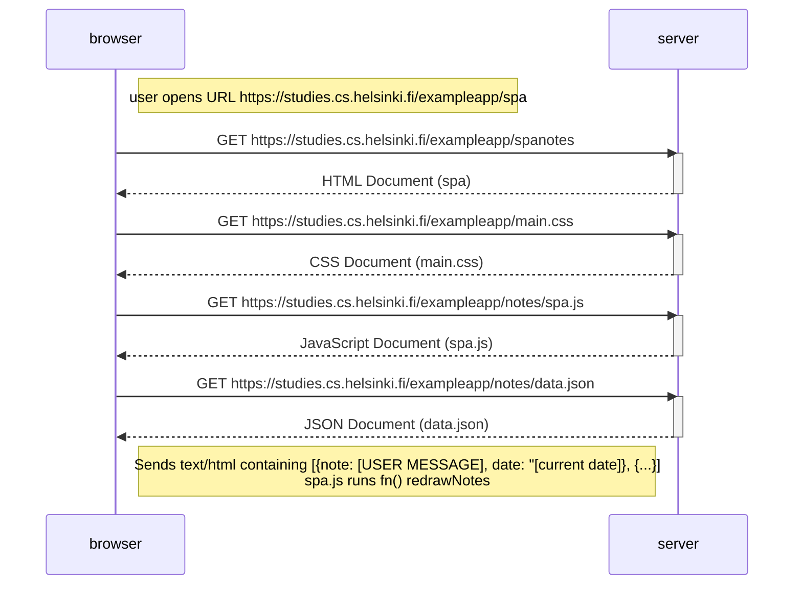

```mermaid
sequenceDiagram
    participant browser
    participant server

note right of browser: user opens URL https://studies.cs.helsinki.fi/exampleapp/spa


browser ->> server: GET https://studies.cs.helsinki.fi/exampleapp/spanotes
activate server
server -->> browser: HTML Document (spa)
deactivate server

browser ->> server: GET https://studies.cs.helsinki.fi/exampleapp/main.css
activate server
server -->> browser: CSS Document (main.css)
deactivate server

browser ->> server: GET https://studies.cs.helsinki.fi/exampleapp/notes/spa.js
activate server
server -->> browser: JavaScript Document (spa.js)
deactivate server

browser ->> server: GET https://studies.cs.helsinki.fi/exampleapp/notes/data.json
activate server
server -->> browser: JSON Document (data.json)
deactivate server
note left of server: Sends text/html containing [{note: [USER MESSAGE], date: "[current date]}, {...}] <br/> spa.js runs fn() redrawNotes


```