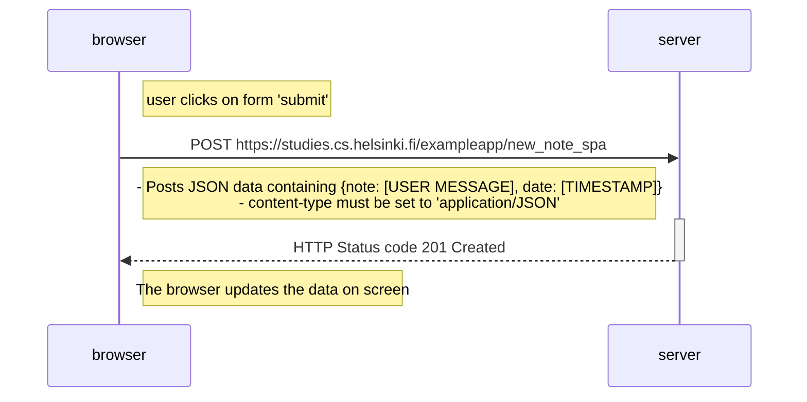

```mermaid
sequenceDiagram
    participant browser
    participant server

note right of browser: user clicks on form 'submit'

browser ->> server: POST https://studies.cs.helsinki.fi/exampleapp/new_note_spa
note right of browser: - Posts JSON data containing {note: [USER MESSAGE], date: [TIMESTAMP]} <br/>- content-type must be set to 'application/JSON'
activate server
server -->> browser: HTTP Status code 201 Created
deactivate server
note right of browser: The browser updates the data on screen


```